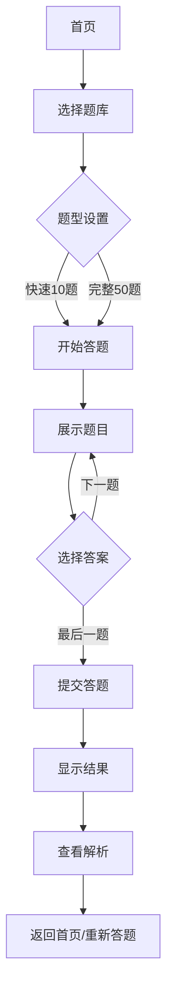
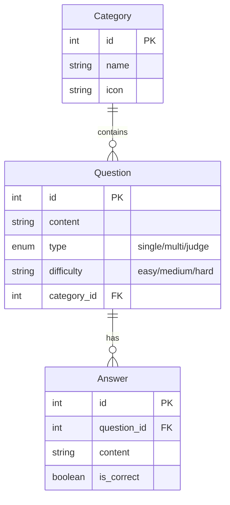

# 答题系统 PRD

## 1. 产品概述

一款面向移动端的在线答题系统，支持单选题、多选题和判断题三种题型。用户可以随时开始答题，实时查看得分，并回顾错题记录。

- **目标用户**：学生、求职者、培训机构学员
- **核心价值**：便捷的碎片化学习工具，随时随地检验知识掌握程度

## 2. 核心功能

### 2.1 用户角色

| 角色 | 注册方式 | 核心权限 |
|------|----------|----------|
| 游客用户 | 无需注册 | 浏览题目、答题、查看结果 |
| 注册用户 | 手机号/邮箱 | 保存答题记录、收藏题目、查看历史 |

### 2.2 功能模块

1. **首页**：题库分类展示、开始答题入口、我的记录
2. **答题页**：题目展示、选项选择、计时器、进度显示
3. **结果页**：得分展示、正确答案对比、错题解析
4. **我的**：答题历史、收藏题目、设置

### 2.3 页面详情

| 页面名称 | 模块名称 | 功能描述 |
|----------|----------|----------|
| 首页 | 题库分类 | 按学科/难度分类展示题库 |
| 首页 | 开始答题 | 选择题库后进入答题 |
| 答题页 | 题目区域 | 显示题目内容、题型标签 |
| 答题页 | 选项区域 | 单选/多选/判断选项展示 |
| 答题页 | 进度条 | 显示当前进度和时间 |
| 结果页 | 得分展示 | 动画显示得分和正确率 |
| 结果页 | 答案对比 | 显示用户答案与正确答案 |
| 我的 | 历史记录 | 展示过往答题记录列表 |

### 2.4 题库数据

题库来源：**安全生产月知识竞赛参考题库（安全管理）**

| 题型 | 题量 | 说明 |
|------|------|------|
| 单选题 | ~100+ | 每题4个选项 |
| 多选题 | ~40+ | 每题2-4个选项 |
| 判断题 | ~40+ | 正确/错误 |

## 3. 核心流程

### 3.1 答题流程

### 3.2 题目数据模型

## 4. 用户界面设计

### 4.1 设计风格

- **主题**：现代简约卡片式设计
- **主色调**：#4F46E5（靛蓝色）
- **辅助色**：#10B981（翠绿色，答对）、#EF4444（红色，答错）
- **背景色**：#F8FAFC（浅灰白）
- **字体**：Noto Sans SC（中文）
- **圆角**：16px（卡片）、8px（按钮）
- **阴影**：柔和投影营造层次感

### 4.2 页面设计概览

| 页面名称 | 模块名称 | 界面元素 |
|----------|----------|----------|
| 首页 | 题库卡片 | 分类图标、题目数量、开始按钮 |
| 首页 | 快捷入口 | 历史记录、我的收藏 |
| 答题页 | 题目卡片 | 题号、题型标签、内容、选项列表 |
| 答题页 | 底部导航 | 上一题、下一题、提交按钮 |
| 结果页 | 得分环 | 圆形进度动画、分数数字 |
| 结果页 | 答题卡 | 题目列表、正确/错误图标标记 |

### 4.3 响应式设计

- 移动端优先设计（375px - 428px）
- 最大宽度 480px，居中显示
- 触摸优化：点击区域最小 44px
- 安全区域适配：iPhone刘海屏/底部横条

### 4.4 交互动效

- 页面切换：左右滑动过渡
- 选项选中：缩放 + 边框高亮
- 答案提交：选项颜色变化反馈
- 得分展示：数字滚动动画
