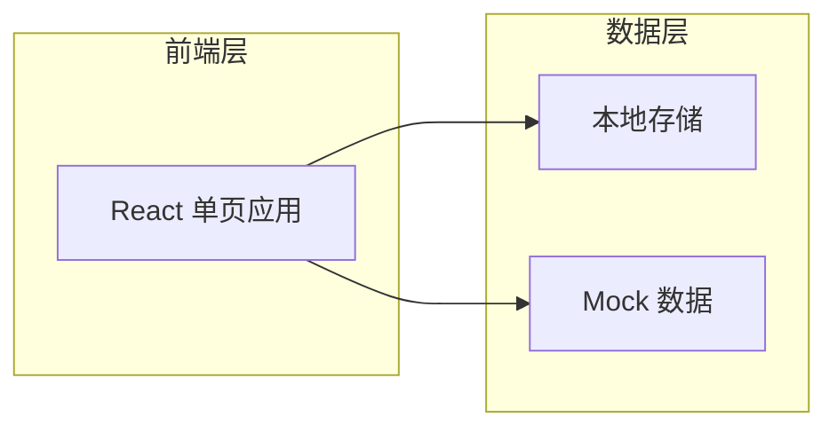
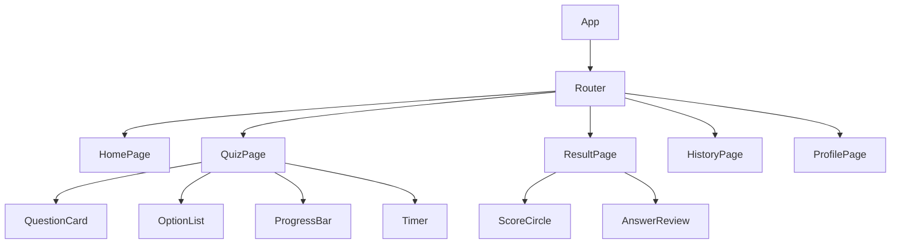

# 答题系统技术架构

## 1. 架构设计



## 2. 技术选型

| 类别 | 技术 |
|------|------|
| 前端框架 | React 18 |
| 构建工具 | Vite |
| 样式方案 | Tailwind CSS |
| 状态管理 | React Hooks + Context |
| 路由 | React Router v6 |
| 动画 | Framer Motion |
| 数据存储 | localStorage |

## 3. 路由定义

| 路由 | 页面 | 描述 |
|------|------|------|
| `/` | HomePage | 首页，展示题库分类 |
| `/quiz/:categoryId` | QuizPage | 答题页面 |
| `/result/:sessionId` | ResultPage | 结果展示页面 |
| `/history` | HistoryPage | 历史记录页面 |
| `/profile` | ProfilePage | 个人中心页面 |

## 4. 组件结构



## 5. 数据模型

### 5.1 题目模型

```typescript
interface Question {
  id: number;
  content: string;
  type: 'single' | 'multi' | 'judge';
  difficulty: 'easy' | 'medium' | 'hard';
  categoryId: number;
  answers: Answer[];
}

interface Answer {
  id: number;
  questionId: number;
  content: string;
  isCorrect: boolean;
}
```

### 5.2 答题会话模型

```typescript
interface QuizSession {
  id: string;
  categoryId: number;
  questions: number[];
  answers: Record<number, number[]>;
  startTime: number;
  endTime?: number;
  score?: number;
}
```

### 5.3 题库分类

```typescript
interface Category {
  id: number;
  name: string;
  icon: string;
  questionCount: number;
  description: string;
}
```

## 6. Mock 数据

系统内置以下题库：

| 分类 | 题量 | 包含题型 |
|------|------|----------|
| 语文知识 | 20 | 单选、多选、判断 |
| 数学基础 | 20 | 单选、判断 |
| 英语词汇 | 20 | 单选 |
| 常识百科 | 20 | 单选、多选、判断 |

## 7. 性能优化

- 图片懒加载
- 答案数据本地缓存
- 路由级代码分割
- 触摸事件优化
